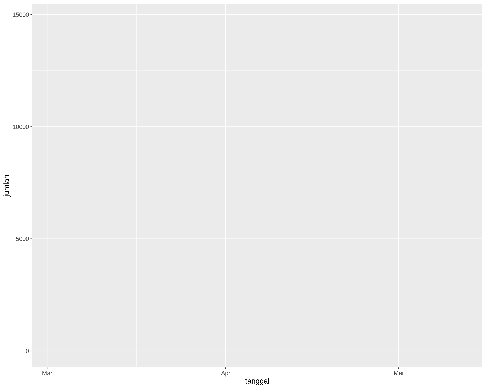

# Perkembangan Kasus Covid-19 Indonesia

_Repositori ini merupakan hasil klon dari_ [_analisis koronavirus di Ceko_](https://github.com/jlacko/koronavirus) _oleh J. Lacko. Dimodifikasi, disesuaikan, dan dimutahirkan menggunakan data penyebaran koronavirus Indonesia._

Representasi grafis dari kasus penyebaran koronavirus baru (nCoV-19) di Indonesia. Sumber data dari basis data yang terkenal di dunia saat ini yaitu Universitas John Hopkins, tersedia di GitHub: https://github.com/CSSEGISandData/COVID-19

Fakta jumlah kasus sesuai dengan data yang dilaporkan per 28 Maret 2020. Model sesuai dengan tren pada 20 Maret 2020, yang hingga 28 Maret 2020 memperlihatkan hubungan yang selaras dengan keadaan di lapangan.

  

Kita berharap grafik akan terus mendatar (semendatar mungkin), berada di bawah titik-titik jumlah prediksi, yang berarti kita menang melawan koronavirus.

Sebagai perbandingan diberikan pula tren dari negara lain di dunia. Kita dapat melihat bagaimana peningkatan kasus secara eksponensial mulai berhenti di Tiongkok dan Korea Selatan, melambat di Jepang dan Malaysia, namun tetap bertahan di Italia, Iran, dan USA.

  

_Dimutakhirkan pada 30 Maret 2020_