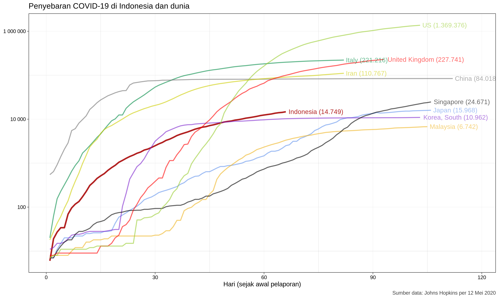

# Perkembangan Kasus Covid-19 Indonesia

_Repositori ini merupakan hasil klon dari_ [_analisis koronavirus di Ceko_](https://github.com/jlacko/koronavirus) _oleh J. Lacko. Dimodifikasi, disesuaikan, dan dimutahirkan menggunakan data penyebaran koronavirus Indonesia._

Representasi grafis dari kasus penyebaran koronavirus baru (nCoV-19) di Indonesia. Sumber data dari basis data yang terkenal di dunia saat ini yaitu Universitas John Hopkins, tersedia di GitHub: https://github.com/CSSEGISandData/COVID-19

Fakta jumlah kasus sesuai dengan data yang dilaporkan per 1 April 2020. Model sesuai dengan tren sejak 25 Maret 2020 (sepekan terakhir). Jumlah kasus lebih rendah dari prediksi.

  

Kita berharap grafik akan terus mendatar (semendatar mungkin), berada di bawah titik-titik (* * *) prediksi, yang berarti kita menang melawan koronavirus.

Sebagai pembanding diberikan pula grafik jumlah kasus Covid-19 dari negara lain di dunia. Kita dapat melihat bagaimana peningkatan kasus secara eksponensial mulai berhenti di Tiongkok dan Korea Selatan, melambat di Jepang, Singapura, dan Malaysia, namun tetap bertahan naik di Italia, Iran, dan Amerika Serikat, juga Inggris.

  

_Dimutakhirkan pada 2 April 2020_